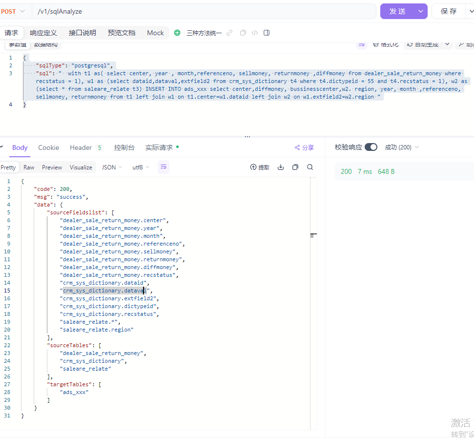
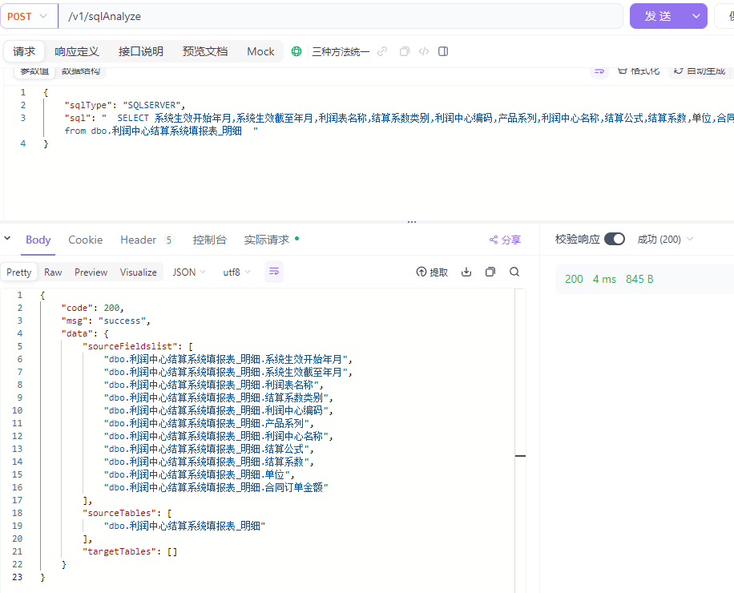
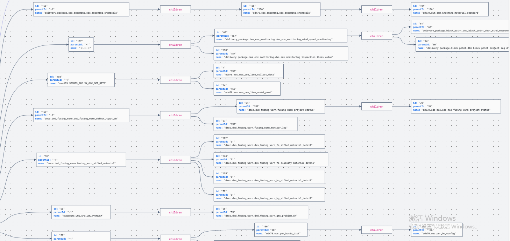

# 🔍 SQLFlow Data Lineage Analyzer

**Automated SQL Data Lineage Tracking with JSON Output**

🚀 版本: 1.0.0 | 📅 最后更新: 2025-05-08


## 🌟 项目简介

​		本工具通过解析用户提交的 **SQL 语句** 和 **数据库类型**，自动生成数据血缘关系的结构化 JSON 报告，包括来源表、目标表、字段映射关系等核心元素。适用于数据治理、ETL 流程审计和元数据管理场景


### 📜 背景与意义

​		数据血缘分析是数据治理的核心技术之一，能追踪数据从源头到终端的流动路径，解决“数据的哲学三问”——**我是谁？我从哪里来？我到哪里去？**在数据爆炸式增长和合规监管趋严的背景下，企业亟需通过自动化工具实现：

1. **数据透明化**：快速定位数据异常源头（如字段级血缘追踪）

2. **合规审计**：识别敏感数据流向，确保符合 GDPR 等法规要求

3. **流程优化**：通过血缘图谱分析 ETL 依赖关系，减少冗余计算

4. **适用场景**：企业级复杂 SQL 解析、高精度字段级血缘追踪、与数据治理平台集成

   

### 🔑主要功能

- **SQL 解析**: 支持主流数据库方言（MySQL、PostgreSQL、Oracle、DM、SQLSERVER、Hive） 等的解析

- **血缘可视化**: 以 JSON 格式输出表级/字段级血缘路径

- 核心工具**：Druid、ANTLR、JSQLParser、Deepseek**

  

## 🛠️ 快速开始

### 环境要求

- Python 3.8+
- JDK1.8
- Docker（可选容器化部署）


## 📡 API 文档

### 请求端点

```
POST http://120.24.160.67:8891/v1/sqlAnalyze
```

### 请求参数示例

```json
{
    "sqlType": "postgresql",
    "sql": "  with t1 as( select center, year , month,referenceno, sellmoney, returnmoney ,diffmoney from dealer_sale_return_money where recstatus = 1), w1 as (select dataid,dataval,extfield2 from crm_sys_dictionary t4 where t4.dictypeid = 55 and t4.recstatus = 1), w2 as (select * from saleare_relate t3) INSERT INTO ads_xxx select center,diffmoney, bussinesscenter,w2. region, year, month ,referenceno, sellmoney, returnmoney from t1 left join w1 on t1.center=w1.dataid left join w2 on w1.extfield2=w2.region "
}
```

### 响应示例

```json
{
    "code": 200,
    "msg": "success",
    "data": {
        "sourceFieldslist": [
            "dealer_sale_return_money.center",
            "dealer_sale_return_money.year",
            "dealer_sale_return_money.month",
            "dealer_sale_return_money.referenceno",
            "dealer_sale_return_money.sellmoney",
            "dealer_sale_return_money.returnmoney",
            "dealer_sale_return_money.diffmoney",
            "dealer_sale_return_money.recstatus",
            "crm_sys_dictionary.dataid",
            "crm_sys_dictionary.dataval",
            "crm_sys_dictionary.extfield2",
            "crm_sys_dictionary.dictypeid",
            "crm_sys_dictionary.recstatus",
            "saleare_relate.*",
            "saleare_relate.region"
        ],
        "sourceTables": [
            "dealer_sale_return_money",
            "crm_sys_dictionary",
            "saleare_relate"
        ],
        "targetTables": [
            "ads_xxx"
        ]
    }
}
```

## 


##  ☕效果预览


### 示例1:



### 示例2:

## 


## 🚨 注意事项

- 📌 确保 SQL 语句包含完整的上下文（如 CTE 定义）
- 🔧 复杂嵌套查询建议先通过 SQL 格式化工具 预处理


##  ❤未来计划

- 可视化模块完善
- 图数据库
- 邮箱email: 742729764@qq.com





